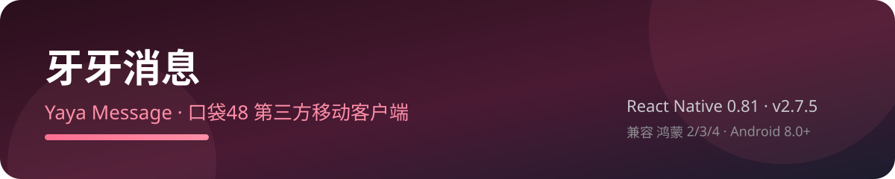

<p align="center">
  
</p>
<p align="center">
  
</p>

<p align="center">
  <a href="LICENSE"></a>
  <a href="https://github.com/Xenia0922/yaya_msg_mobile/releases"></a>
  
</p>

# 牙牙消息

口袋48 第三方移动客户端（React Native），基于 [yk1z/yaya_msg](https://github.com/yk1z/yaya_msg) 二次开发。

## 功能

- 房间消息 / 私信 / 翻牌
- 口袋直播与回放（断点续播、录播按日期分组）
- B站直播（弹幕、画质切换、公演封面与标题）
- 音乐库（分团筛选、搜索、歌词、收藏、播放记忆）
- 翻牌统计、成员数据库、鸡腿充值
- 直播/录播「关注」筛选、实时开播检测

## 安装

从 [Releases](https://github.com/Xenia0922/yaya_msg_mobile/releases) 下载：

- `yaya-msg-mobile-v2.7.apk`：通用包（全 ABI，体积最大）
- `yaya-msg-mobile-v2.7-x64.apk`：x86_64 模拟器专用
- `yaya-msg-mobile-v2.7-v8a.apk` / `-v7a.apk`：真机包（**推荐真机使用**，比通用包小约 40%）

模拟器请用 x64 包，否则无法启动。App 内「检查更新」始终提供通用包直链，真机如需最小体积请在 Release 页面按架构下载。

## 构建

```sh
npm install --legacy-peer-deps
node scripts/build-apk.js
```

产物输出到 `E:/yymsg/APK/`。

## 兼容

鸿蒙 2/3/4 与 Android 8.0+（minSdk 26）。

## 致谢

基于 [yk1z/yaya_msg](https://github.com/yk1z/yaya_msg) 二次开发。
